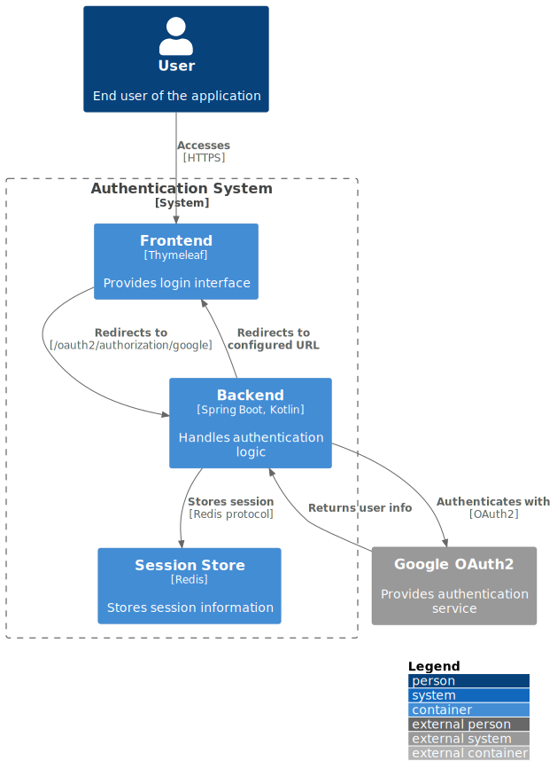

# Authentication Service

[](https://github.com/ktenman/auth/actions/workflows/ci.yml)

## Overview

This authentication service is a Spring Boot application written in Kotlin that provides OAuth2 authentication using
Google as the identity provider. It's designed to be a secure and scalable solution for handling user authentication in
web applications.



## Features

- OAuth2 authentication with Google
- Session management using Redis
- Configurable allowed email addresses
- Custom authentication success handler
- Secure logout mechanism
- Session validation endpoint

## Technologies Used

- Kotlin 2.0.0
- Spring Boot 3.3.1
- Spring Security
- Redis for session storage
- Thymeleaf for server-side templating
- Docker for containerization

## Prerequisites

- JDK 21
- Docker and Docker Compose
- Redis
- Google OAuth2 credentials (Client ID and Client Secret)

## Configuration

The application uses environment variables for configuration. Make sure to set the following variables:

- `GOOGLE_CLIENT_ID`: Your Google OAuth2 client ID
- `GOOGLE_CLIENT_SECRET`: Your Google OAuth2 client secret
- `REDIRECT_URI`: The URI to redirect after successful authentication
- `ALLOWED_EMAILS`: Comma-separated list of email addresses allowed to authenticate

## Running the Application

1. Set up the environment variables mentioned above.
2. Start Redis using Docker Compose:
   ```bash
   docker-compose up -d
    ```
3. Run the application using Gradle:
   ```bash
   ./gradlew bootRun
   ```

The application will start on port 8083 by default.

## API Endpoints

* `/login`: Login page
* `/oauth2/authorization/google`: Initiates Google OAuth2 authentication
* `/user`: Returns authenticated user information
* `/validate`: Validates the current session
* `/logout`: Logs out the current user

## Security Considerations

- Only configured email addresses are allowed to authenticate
- Sessions are stored securely in Redis
- CSRF protection is enabled
- Secure cookie settings for session management

## Development

To set up the development environment:

1. Clone the repository
2. Import the project into your IDE as a Gradle project
3. Ensure you have the required environment variables set
4. Run the AuthApplication.kt file to start the application

## Testing

Run the tests using:
```bash
./gradlew test
```

## ./gradlew test

The application includes a Dockerfile for easy containerization. To build and run the Docker image:

1. Build the Docker image:
   ```bash
   docker build -t auth-service .
   ```

2. Run the Docker container:
   ```bash
    docker run -p 8083:8083 -e GOOGLE_CLIENT_ID=your_client_id -e GOOGLE_CLIENT_SECRET=your_client_secret -e REDIRECT_URI=your_redirect_uri -e ALLOWED_EMAILS=allowed@email.com auth-service
    ```

--

This README provides a comprehensive overview of the authentication service, including its features, setup instructions,
and deployment guidelines, without the PlantUML diagram.
